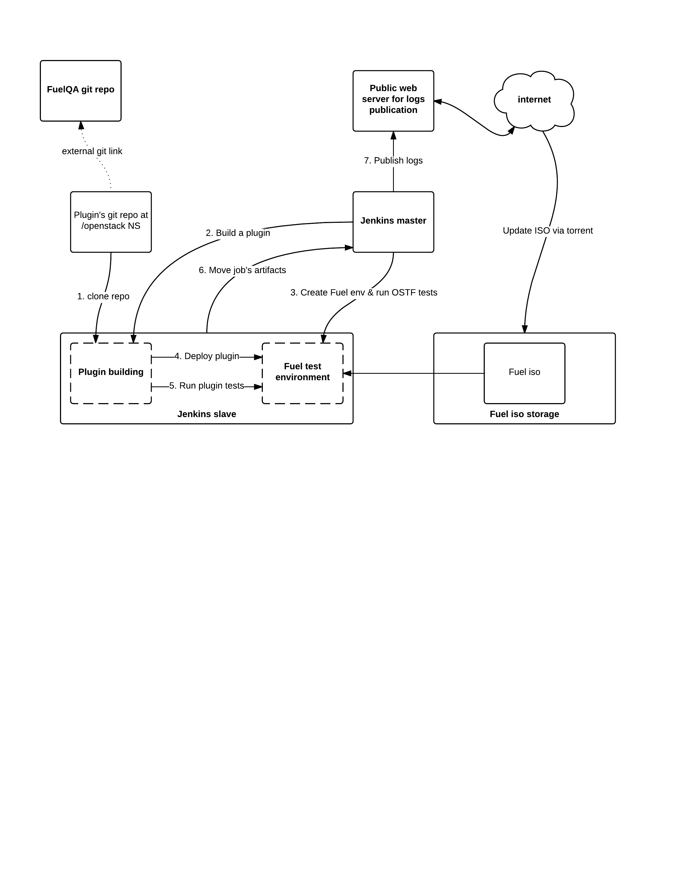

Fuel Plugin CI
==============

Overview
--------

Components, concept

Jenkins and web server for logs installation
--------------------------------------------

First you should install puppet master and run the manifests.

All nodes described in ``manifests/site.pp`` file.

CI needs the following amount of nodes:
* one node for jenkins master
* one more for jenkins slave 
* one for log publication.

These nodes should be described in ``manifests/site.pp`` with necessary classes::
``class { '::fuel_project::jenkins::slave':}``
``class { '::fuel_project::jenkins::master':}``
``class {‘::fuel_project::web:}``

Run install script ``sudo puppet-manifests/bin/install_puppet_master.sh`` on every node.

Gerrit Integration overview
+++++++++++++++++++++++++++

In general, the installation should meet the following
requirements:
* Anonymous users can read all projects.
* All registered users can perform informational code review (+/-1) on any project.
* Jenkins can perform verification (blocking or approving: +/-1).
* All registered users can create changes.
* Members of core group can perform full code review (blocking or approving: +/- 2)
  and submit changes to be merged.

#. Make sure you have gerrit account on review.openstack.org::

    ssh -p 29418 review.openstack.org "gerrit create-account \
         --group 'Third-Party CI' \
         --full-name 'Some CI Bot' \
         --email ci-bot@third-party.org \
         --ssh-key 'ssh-rsa AAAAB3Nz...zaUCse1P ci-bot@third-party.org' \
           some-ci-bot

Jenkins gerrit plugin configuration
+++++++++++++++++++++++++++++++++++

#. The settings look as follows:

   .. image:: pics/settings.png

#. It's main gerrit configuration window. You should add a gerrit server.

   .. image:: pics/settings-full.png

#. Vote configuration.

#. Log publication
The result of job are artifacts - logs and packages. Logs should be published on special web servers, where it can be accessible via gerrit. Web server deploys with puppet class fuel_project::web. Logs copy via ssh by job fuel-plugins.publish_logs. You should add new user with rsa key installed and necessary path accessible for write (like /var/www/logs). REPORTED_JOB_URL variable is responsible for url of logs in gerrit.

Jenkins plugins installation
-----------------------------
We recommend to install these plugins for Jenkins.
Some of them are necessary for CI and other is just useful and make your jenkins experience easier: 
* `AnsiColor <https://wiki.jenkins-ci.org/display/JENKINS/AnsiColor+Plugin>`_
* `Ant Plugin <https://wiki.jenkins-ci.org/display/JENKINS/AnsiColor+Plugin>`_
* `build timeout plugin <https://wiki.jenkins-ci.org/display/JENKINS/Build-timeout+Plugin>`_
* `conditional buildstep <https://wiki.jenkins-ci.org/display/JENKINS/Conditional+BuildStep+Plugin>`_
* `Copy Artifact Plugin <https://wiki.jenkins-ci.org/display/JENKINS/Copy+Artifact+Plugin>`_
* `Credentials Plugin <https://wiki.jenkins-ci.org/display/JENKINS/Credentials+Plugin>`_
* `CVS Plug-in <https://wiki.jenkins-ci.org/display/JENKINS/CVS+Plugin>`_
* `description setter plugin <https://wiki.jenkins-ci.org/display/JENKINS/Description+Setter+Plugin>`_
* `Email Extension Plugin <https://wiki.jenkins-ci.org/display/JENKINS/Email-ext+plugin>`_
* `Environment Injector Plugin <https://wiki.jenkins-ci.org/display/JENKINS/EnvInject+Plugin>`_
* `External Monitor Job Type Plugin <https://wiki.jenkins-ci.org/display/JENKINS/Monitoring+external+jobs>`_
* `Gerrit Trigger <https://wiki.jenkins-ci.org/display/JENKINS/Gerrit+Trigger>`_
* `GIT client plugin <https://wiki.jenkins-ci.org/display/JENKINS/Git+Client+Plugin>`_
* `GIT plugin <https://wiki.jenkins-ci.org/display/JENKINS/Git+Plugin>`_
* `Groovy <https://wiki.jenkins-ci.org/display/JENKINS/Groovy+plugin>`_
* `Heavy Job Plugin <https://wiki.jenkins-ci.org/display/JENKINS/Heavy+Job+Plugin>`_
* `HTML Publisher plugin <https://wiki.jenkins-ci.org/display/JENKINS/HTML+Publisher+Plugin>`_
* `Javadoc Plugin <https://wiki.jenkins-ci.org/display/JENKINS/Javadoc+Plugin>`_
* `Job Configuration History Plugin <https://wiki.jenkins-ci.org/display/JENKINS/JobConfigHistory+Plugin>`_
* `JUnit Plugin <https://wiki.jenkins-ci.org/display/JENKINS/JUnit+Plugin>`_
* `LDAP Plugin <https://wiki.jenkins-ci.org/display/JENKINS/LDAP+Plugin>`_
* `Locale plugin <https://wiki.jenkins-ci.org/display/JENKINS/Locale+Plugin>`_
* `Mailer Plugin <https://wiki.jenkins-ci.org/display/JENKINS/Mailer>`_
* `MapDB API Plugin <https://wiki.jenkins-ci.org/display/JENKINS/MapDB+API+Plugin>`_
* `Matrix Authorization Strategy Plugin <https://wiki.jenkins-ci.org/display/JENKINS/Matrix+Authorization+Strategy+Plugin>`_
* `Matrix Project Plugin <https://wiki.jenkins-ci.org/display/JENKINS/Matrix+Project+Plugin>`_
* `Maven Integration plugin <https://wiki.jenkins-ci.org/display/JENKINS/Maven+Project+Plugin>`_
* `Multijob plugin <https://wiki.jenkins-ci.org/display/JENKINS/Multijob+Plugin>`_
* `Multiple SCMs plugin <https://wiki.jenkins-ci.org/display/JENKINS/Multiple+SCMs+Plugin>`_
* `OWASP Markup Formatter Plugin <https://wiki.jenkins-ci.org/display/JENKINS/OWASP+Markup+Formatter+Plugin>`_
* `PAM Authentication plugin <https://wiki.jenkins-ci.org/display/JENKINS/PAM+Authentication+Plugin>`_
* `Parameterized Trigger plugin <https://wiki.jenkins-ci.org/display/JENKINS/Parameterized+Trigger+Plugin>`_
* `Publish Over SSH <https://wiki.jenkins-ci.org/display/JENKINS/Publish+Over+SSH+Plugin>`_
* `PWauth Security Realm <http://wiki.hudson-ci.org/display/HUDSON/pwauth>`_
* `Run Condition Plugin <https://wiki.jenkins-ci.org/display/JENKINS/Run+Condition+Plugin>`_
* `SCM API Plugin <https://wiki.jenkins-ci.org/display/JENKINS/SCM+API+Plugin>`_
* `Script Security Plugin <https://wiki.jenkins-ci.org/display/JENKINS/Script+Security+Plugin>`_
* `Self-Organizing Swarm Plug-in Modules <https://wiki.jenkins-ci.org/display/JENKINS/Swarm+Plugin>`_
* `Simple Theme Plugin <http://wiki.jenkins-ci.org/display/JENKINS/Simple+Theme+Plugin>`_
* `SSH Agent Plugin <https://wiki.jenkins-ci.org/display/JENKINS/SSH+Agent+Plugin>`_
* `SSH Credentials Plugin <https://wiki.jenkins-ci.org/display/JENKINS/SSH+Credentials+Plugin>`_
* `SSH Slaves plugin <http://wiki.jenkins-ci.org/display/JENKINS/SSH+Slaves+plugin>`_
* `Subversion Plug-in <http://wiki.jenkins-ci.org/display/JENKINS/Subversion+Plugin>`_
* `Throttle Concurrent Builds Plug-in <http://wiki.jenkins-ci.org/display/JENKINS/Throttle+Concurrent+Builds+Plugin>`_
* `Timestamper <https://wiki.jenkins-ci.org/display/JENKINS/Timestamper>`_
* `Token Macro Plugin <http://wiki.jenkins-ci.org/display/JENKINS/Token+Macro+Plugin>`_
* `Translation Assistance plugin <http://wiki.jenkins-ci.org/display/JENKINS/Translation+Assistance+Plugin>`_
* `Windows Slaves Plugin <http://wiki.jenkins-ci.org/display/JENKINS/Windows+Slaves+Plugin>`_
* `Workflow: Step API <https://wiki.jenkins-ci.org/display/JENKINS/Workflow+Plugin>`_

Jenkins jobs installation
-------------------------

Jenkins Job Builder takes simple descriptions of `Jenkins <http://jenkins-ci.org/>`_
jobs in `YAML <http://www.yaml.org/>`_ or `JSON <http://json.org/>`_
format and uses them to configure Jenkins. 

To install JJB, run the following commands::

    git clone https://git.openstack.org/openstack-infra/jenkins-job-builder
    cd jenkins-job-builder && sudo python setup.py install

JJB requires config file to running::

     [jenkins]
     user=jenkins
     password=1234567890abcdef1234567890abcdef
     url=https://jenkins.example.com

Running::

    jenkins-jobs --conf yourconf.ini update path_to_repo/jjb

We have some examples in our repo, it depersonalized copy of our real
jobs. Don’t install it without reworking. You should replace necessary paths and variables.

Plugin test templates
---------------------

Most of necessary functions can be found in `fuel-qa <https://github.com/openstack/fuel-qa>`_
framework.

All functional tests should be stored in plugin’s git repository.
There should be special folder named plugin_test.
Fuel-qa framework should be submodule in plugin_test folder. You can add submodule by this command:
git submodule add https://github.com/openstack/fuel-qa

<pic>

There is simple test in repository.
It deploys an openstack cluster, installs the test plugin and enables it. 

There are two folders: helpers and tests. 
Helpers consists two files with important functions: 
* prepare_test_plugin - install the plugin to master node
* activate_plugin - activate the plugin
* assign_net_provider - allow to choose network type for cluster
* deploy_cluster - deploy a cluster

Next folder is tests and it includes tests.
There is only one important file named test_smoke_bvt.py.
It describes a class of test plugin and 2 tests.
First of them just install the plugin and enable it, another try to deploy a cluster.

Hardware test examples
----------------------

Main problem of hardware configuration is authorization.
SSH does not allow enter password in script non interactively. But we can use expect utility for resolve this problem. 

You should install the util on jenkins-slave first::

      apt-get install expect

Example of script that use expect for auth on cisco switch and show it’s configuration::

  spawn ssh "root@$switch_ip"
  set timeout 500
  expect "yes/no" {
  send "yes\r"
  expect "*?assword" { send "$switch_pass\r" }
  } "*?assword" { send "$switch_pass\r" }
  expect "# " { send "show run" }
  expect "# " { send "exit\r" }

Fuel iso updating
-----------------

There is a script ``fuel-plugin-ci/iso-updater/get_iso.sh``.

It should be added to cron and run every 2-3 hours.

This script checks for new community build of Fuel and if there is new version available, it downloads it.
You can run the script on jenkins-slave node or any web server if you have many slave nodes.
Steps:

#. Check for the latest community iso. Using w3m utility script checks ``https://www.fuel-infra.org/release/status`` url and choose right tab:

  * the first tab is 8.0 now, we need 2nd tab with Fuel 7.0.

  * Then we parse it and get Fuel release string.

  .. note:: if new Fuel version is available, you should fix the
     script and change tab number. Also output may change between
     linux distros and last cut field may change.

#. Download torrent file from `http://seed.fuel-infra.org/fuelweb-iso/` via aria2 console torrent client.

#. Check for errors and delete folder if there is an error.

#. Sync downloaded iso with jenkins slave. You should have necessary users with rsa keys set.